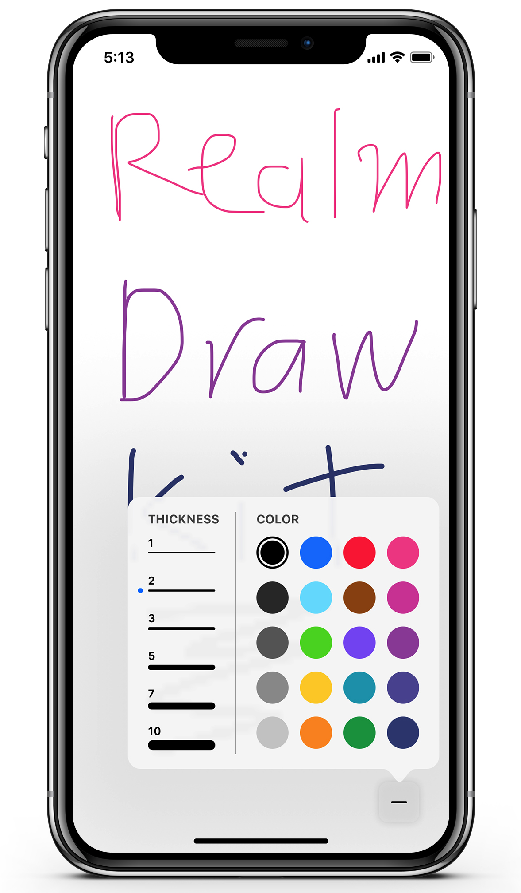

# Realm DrawKit
> A modular drawing library backed by the Realm Mobile Platform to allow cross-device collaboration.

Realm DrawKit is a synchronized drawing framework for iOS, powered by the Realm Mobile Platform. It is written in Swift, and is architected to ensure smoothing drawing, even with realtime synchronization.

Realm DrawKit has been designed to be integrated into apps that would benefit from synchronized sketching, such as annotating documents, or collaborative design.

# Features
* Allows multiple users to draw lines on the same canvas in real time.
* Uses bezier curves to produce a smooth curve for each line.
* Strokes can be set to different widths or colors.
* Writes to Realm are offloaded to a background thread, ensuring the main thread isn't blocked at any point, which would result in choppy strokes.

# Versions & Requirements

* Xcode 9.0 and up
* iOS 9.0 and up

# Third Party Dependencies

### iOS
* [Realm Swift](https://realm.io/docs/swift/latest/) - The Swift version of the Realm Mobile Database.
* [Realm-LoginKit](https://github.com/realm-demos/realm-loginkit) - An login and registration dialog library for making it easier to log into Realm Mobile Platform instances.

# Contributing

See [CONTRIBUTING.md](CONTRIBUTING.md) for more details!

This project adheres to the [Contributor Covenant Code of Conduct](https://realm.io/conduct/). By participating, you are expected to uphold this code. Please report unacceptable behavior to [info@realm.io](mailto:info@realm.io).

# License

Realm DrawKit is licensed under the MIT license. See the LICENSE file for details.

